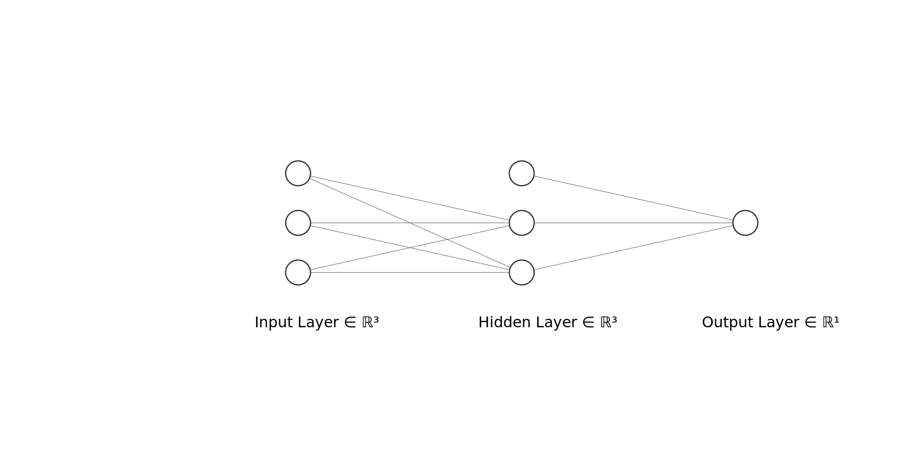

# XOR Problem From Scratch

In this project, I was looking to gain more familiarity with how gradients are passed backwards during gradient descent and to utilize that to solve the toy problem of learning the XOR function from scratch.

A couple of links that I used to find more information or used for inspiration.

https://pages.mtu.edu/~nilufer/classes/cs4811/2016-spring/hw01-neural-networks.pdf

https://medium.com/@jayeshbahire/the-xor-problem-in-neural-networks-50006411840b

https://www.ics.uci.edu/~pjsadows/notes.pdf

## XOR Function for Four Possible Inputs
| Input 1 | Input 2 | Output |
|---------|---------|--------|
|    1    |    1    |    0   |
|    1    |    0    |    1   |
|    0    |    1    |    1   |
|    0    |    0    |    0   |

## Architecture

## Backpropagation

* Derivative for Loss

I used Cross Entropy loss for this model which has the following equation:

  

Then we must take it's derivative:

* Derivative for Sigmoid
* Derivative for Weight multiply
* Derivative for Sigmoid
* Derivative for Weight multiply

Chain rule to combine them for the weights and bias terms

## Optimization

For this problem gradient descent will often get stuck in plateaus. There have been a couple of papers written that highlight that these are not local minima but are actually plateus where the loss function stays relatively constant around a certain point. These plateaus result in almost zero gradient which halts gradient descent on the plateau and results in the model to not be able to reach the absolute minimum of the loss function.

Whether the model gets stuck on a plateau is largely dependent on the initialization of the weights. Since the weights are randomly initialized, sometimes the model will converge to the minima and sometimes the model will not converge in a reasonable amount of epochs.
